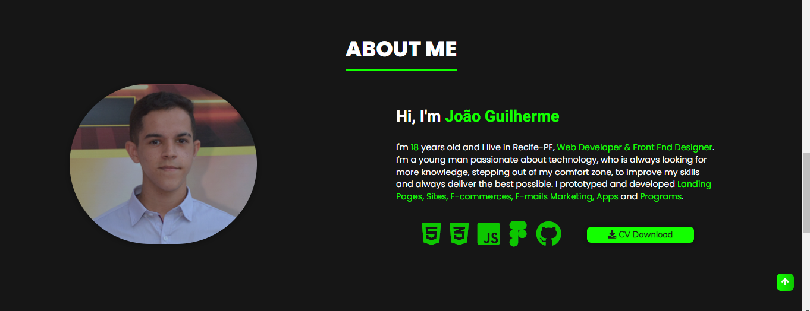

# My Portfolio 

<!---Esses são exemplos. Veja https://shields.io para outras pessoas ou para personalizar este conjunto de escudos. Você pode querer incluir dependências, status do projeto e informações de licença aqui--->

>  Portfolio for project presentation, contact form and knowledge.
### Adjustments and improvements

The project is under development. Missing steps:

- [x] Body with HTML.
- [x] Stylization with CSS.
- [x] Class switching with JavaScript for the Hamburger menu
- [x] Responsiveness
- [x] 3º project of Section Projects
- [x] Margin between card on na section Knowledges
- [x] New color palette
- [ ] Tradution

## 🤝 Collaborator

<table>
  <tr>
    <td align="center">
      <a href="#">
         
        
          <b>João Guilherme</b>
        
      </a>
    </td>
  </tr>
</table>

## Technologies
Technologies used in the project:

