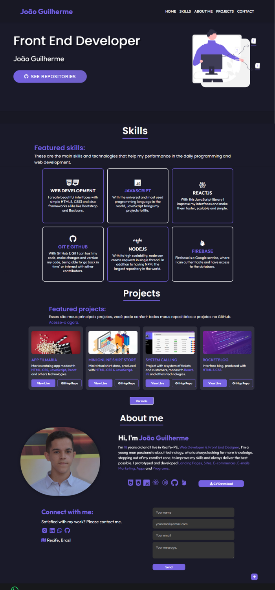

# My Portfolio 

<!---Esses são exemplos. Veja https://shields.io para outras pessoas ou para personalizar este conjunto de escudos. Você pode querer incluir dependências, status do projeto e informações de licença aqui--->

>  Hello! This is my portfolio. Here you will find every informations about me.
### ⚙️ Link

Link da aplicação: <a>http://jguilhermesl.com.br</a>
### ⚙️ Adjustments and improvements

The project has been finished.

- [x] Body with HTML.
- [x] Stylization with CSS.
- [x] Class switching with JavaScript for the Hamburger menu
- [x] Responsiveness
- [x] Sections home, about me, skills, projects and contact 
- [x] New design
- [x] Form activation

## 🤝 Collaborator

<table>
  <tr>
    <td align="center">
      <a href="#">
         
        
          <b>João Guilherme</b>
        
      </a>
    </td>
  </tr>
</table>

## 👨‍💻 Technologies
Technologies used in the project:

